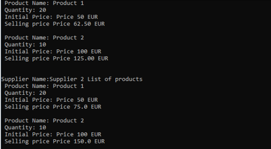

# Vežba – Arhitektura, projektni obrazci

Kreirajte novi *solution* u Visual Studio-u okruženju koje sadrži glavni .NET konzolni projekat.  
Aplikacija treba da prikaže listu dostupnih proizvoda i njihove prodajne cene za svakog dobavljača (supplier-a).

Svaki proizvod treba da ima: jedinstveni identifikator (ID), naziv, količinu na stanju, oznaku dostupnosti (availability) i prodajnu cenu.  
Proizvod je **dostupan** ako je njegova količina veća od nule.

Svaki dobavljač (supplier) treba da ima: jedinstveni identifikator (ID), naziv, listu proizvoda koje nudi i **maržu** (markup) izraženu u procentima.  
Marža se dodaje na početnu cenu proizvoda kako bi dobavljač izračunao prodajnu cenu.

> **Napomena:** _Finalan broj proizvoda ne zavisi od toga da li se ista instanca proizvoda nalazi kod različitih proizvođaća. Cilj ove aplikacije da je da se prikažu cene proizvoda kod različitih dobavljača._

Primer mogućeg izlaza (ispisa) aplikacije:

## Dodatni zahtevi

- Organizujete strukturu aplikacije tako da prati _Clean Architecture_
- Aplikacija mora imati mogućnost da skladišti podatke u okviru proizvoljne baze podataka. Za početak neka to bude kolekcija u memoriji.
- Aplikacija pored konzolne aplikacije mora posedovati i Web API preko koga će se pristupati podacima
